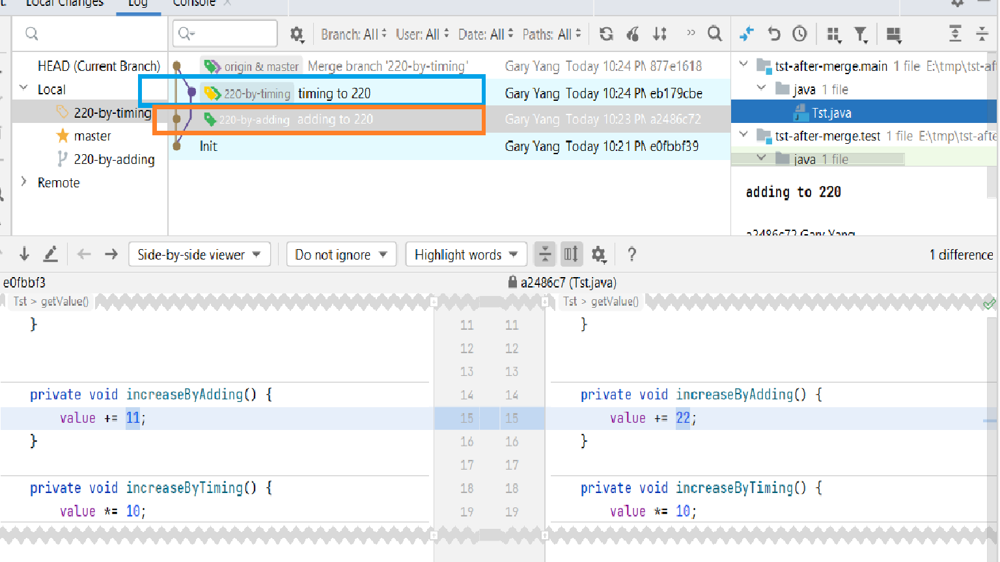

# Branching strategy and race condition

This is a simple example of two health branches auto merged one branch with no conflict but breaks logic. 
the two branches

##Developers have different ideas/implementations that can conflict. 

Repo can force branch "linear history", it forces conflicts resolved before merge into branch, but it's not practical:

1) Usually there is not many conflicts, it's frustrated for devs to pull rebase all the time. 
1) Make people race to merge: merge/push 1st and let others resolve the conflicts ....

Enable auto merge and let branch strategy and auto tests should catch it as early as possible.

The simple better solution for this example is to run tests after merged.
But tests take hours to finish, have to balance between quality and productivity. 

## When conflict detected by auto tests on H:

                  E---F---G  topicA
                 /         \
    A--B--[C]---D---- H----[I]---
            \        /
             J--K--L        topicB
             
Last test success on C, and failed on I, 
run test on:
             H   success
            / \ 
           G   F

run test on:
            H   failure
           / \
          L   K